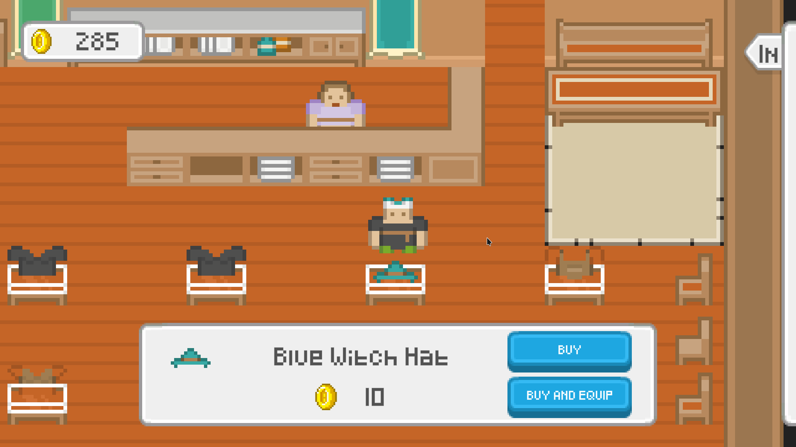

# Clothes Shop

This repository contains the code for an interactive clothes shop as part of an interview task done over a period of 48 hours. The aim of this task is to create a simple game-like experience similar to "The Sims" or "Stardew Valley" where users can browse and purchase clothes for their characters.

## Features

- Item icons
- Item prices
- Equip / Unequip items
- Buying / Selling items
- Clothes are visible on the player
- UI

## Installation

Download and unzip the latest release from the releases page. Run the executable file to start the game.

